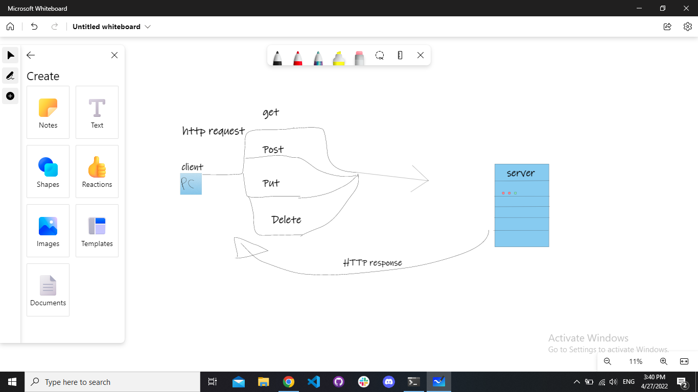
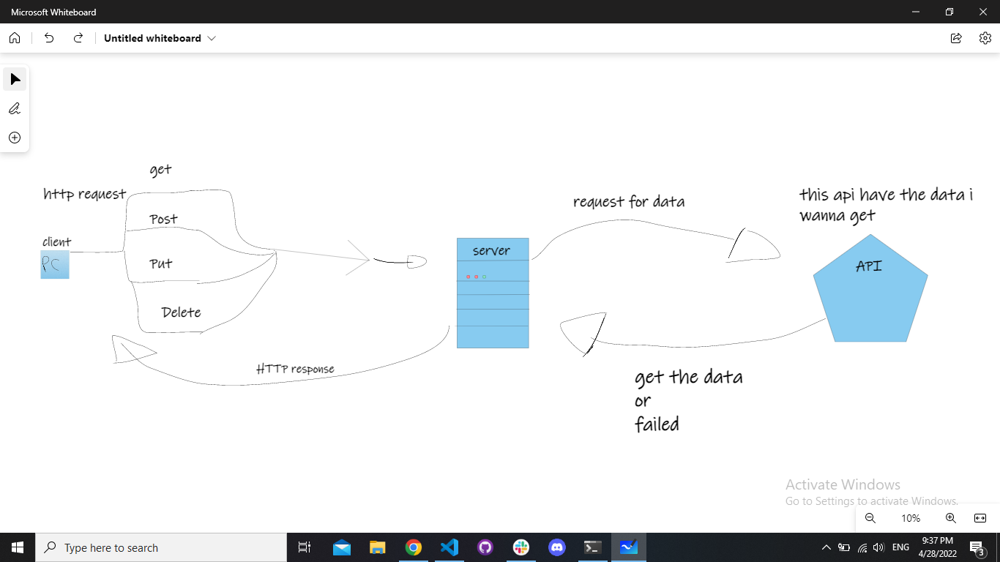
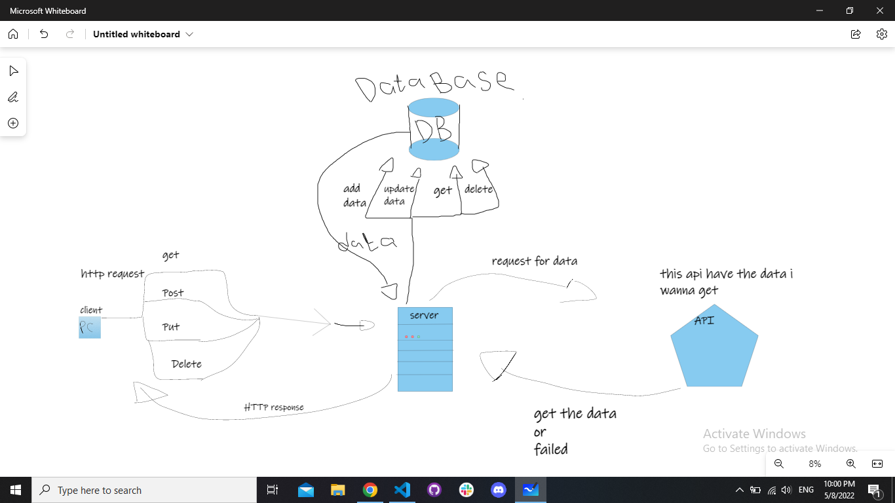

# Movies-Library - 3.0.0 

**Author Name**: Mohammad Azim

## WRRC
[]


[]


[]


## Overview

## Getting Started
<!-- What are the steps that a user must take in order to build this app on their own machine and get it running? -->

1- download node.js


2- command ``` npm init -y ``` : that will make the project


3- command ``` npm install express ``` : that will download the express frame worke it will help you to make node.js project


4- know go to the main file witch in my case is the index.js


5- requer the express framework ``` const express = require('express'); ```


``` const app = express(); ```

6- make leistner  to the port 3000 

```app.listen(port, () => {console.log('we know listen to the appform port 3000');}) ```


7- make routs 

``` app.get('/', homeHaldler);```

``` app.get('/favorite', favoriteHaldler); ```

7- handle the responce for each rout 

``` function homeHaldler(req, resp) {let move=newMovies(moveData.title, moveData.poster_path, moveData.overview);resp.send(move);} ```


```function favoriteHaldler(request, response) { response.send('Welcome to Favorite Page');} ```


8- getting data from third API  usning axios about moves and persons 

9- there is four links  use the API two for ternding person and move  and the other two for searching 

10- this code to get data form api and search on move name 
~~~
function searchMove(request, response) {

    let nameew = request.query.name;
    let url = `https://api.themoviedb.org/3/search/movie?api_key=${apiKey}&query=${nameew}`;

    axios.get(url).then((result) => {

        let trendMove = result.data.results.map((ternd) => {
            return new Trend(
                ternd.id,
                ternd.title,
                ternd.release_date,
                ternd.poster_path,
                ternd.overview
            );
        });
        response.send(trendMove);

    }).catch((error => {
        console.log(error);
        response.send("error in getting data from API search")
    }))
}

~~~

## Project Features

this porject not finished yet 


just have two pages home with the move Data and the second page have welcoming message

now i add the api requests for search and get trend moves and persons

today make a database with postgres  can add move data now and get it from the data base